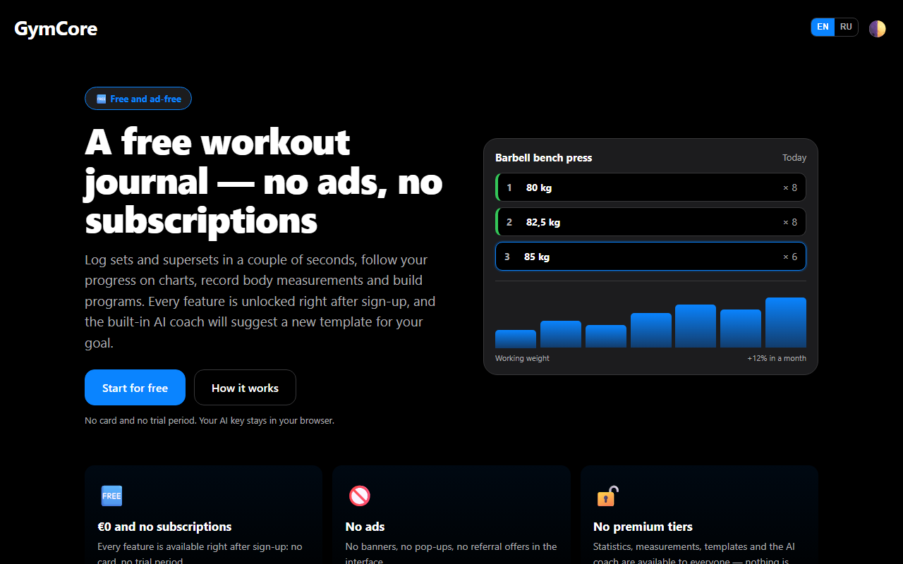
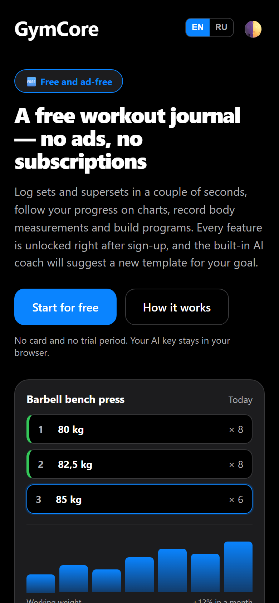
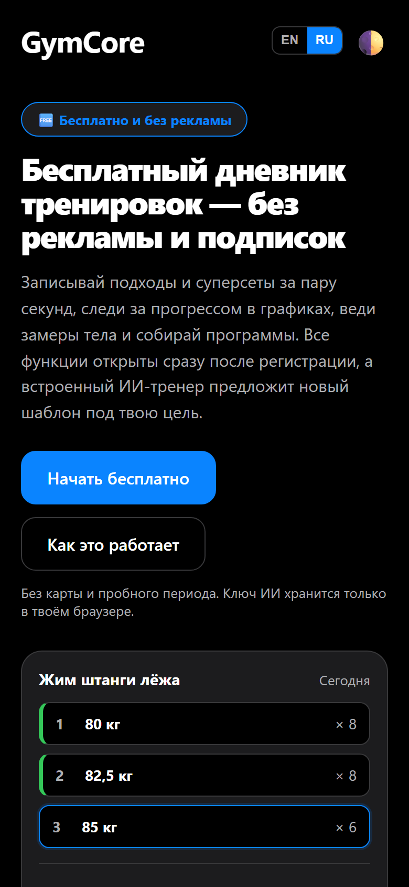

# GymCore — free workout journal, no ads and no subscriptions

**▶ Try it now: [gymcore-omega.vercel.app](https://gymcore-omega.vercel.app/)** &nbsp;·&nbsp; [Русская версия →](README.ru.md)

Log sets and supersets in a couple of seconds, watch your progress on charts, keep body measurements
and build training programs. Every feature — statistics, measurements, templates and the AI coach —
is unlocked right after sign-up. No card, no trial period, no ads, no premium tiers.

## Screenshots

Phone-first — the same app in English and Russian:

  
  

## What you get

| Feature | What it does |
| --- | --- |
| 🏋️ **Workout journal** | Sets, weight, reps and supersets. The draft survives a closed tab. |
| 📅 **History and calendar** | Every workout by day — open a day and see exactly what you did. |
| 📈 **Progress statistics** | Volume and dynamics per exercise across your whole history, not just the last 10 workouts. |
| 📏 **Body measurements** | Weight, chest, waist, biceps, hips, shoulders — with change history. |
| 🧩 **Program templates** | Build a program once and start it in one click. |
| 🤝 **Program sharing** | Send a program as a link — a friend installs it with one tap. |
| 📚 **312 exercises with anatomy** | Ready-made library plus your own exercises; you see which muscles work. |
| 🤖 **AI coach (optional)** | Plug in your own Gemini / Claude / GPT key — it is stored in your browser only. |
| 📤 **Your data is yours** | Export your whole history to JSON at any time. Nothing is locked in. |
| 📱 **Phone-first, installable** | Opens in the browser, adds to the home screen; dark theme and large buttons for the gym. |

Interface in **English and Russian** (switch any time).

## How it works

1. **Create an account** — a username and a password, 20 seconds.
2. **Add exercises** — your own, or install a ready-made program.
3. **Log your sets** during the workout — the draft is saved as you go.
4. **Watch your progress** — charts, measurements and day-by-day history.

## FAQ

**Is it free?** Yes, completely: journal, statistics, measurements, templates and the AI coach —
no subscriptions, no ads, no premium tiers.

**Do I need a card or a trial?** No. A username and a password, no payment details, no time limit.

**Do I need internet?** Yes, the data lives in the cloud, so after signing in it is available on any device.

**Where does my data go?** Into a secure database only you can access; full JSON export any time.

**Is there a mobile app?** GymCore is a web app — it opens in your phone browser and installs to the home screen.

## Tech

Next.js 16 (App Router, Server Actions) · React 19 · TypeScript · Drizzle ORM · PostgreSQL · Cloudinary · next-intl (en/ru).
Development and deployment notes: [docs/DEV.md](docs/DEV.md).

## Help it grow (free)

- ⭐ **Star this repo** — the easiest way to support a small free project.
- 🔗 **Share the link** [gymcore-omega.vercel.app](https://gymcore-omega.vercel.app/) with someone who still keeps
  a notebook on the rack — or send them a **program link** from inside the app.
- 🐞 **Found a bug or want a feature?** Open an issue.

## License

MIT — see [LICENSE](LICENSE). Use it, fork it, self-host it.

